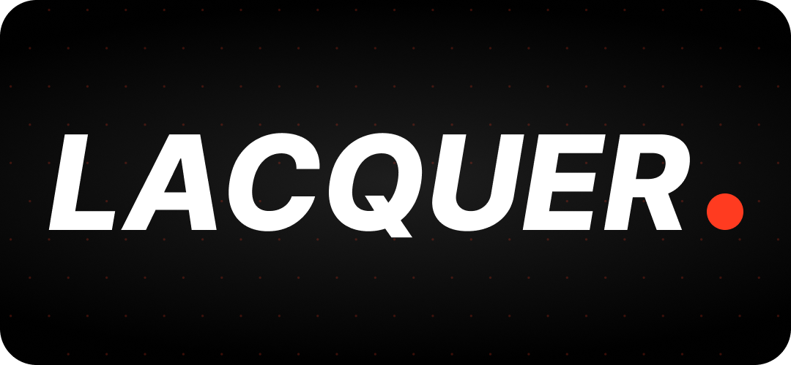
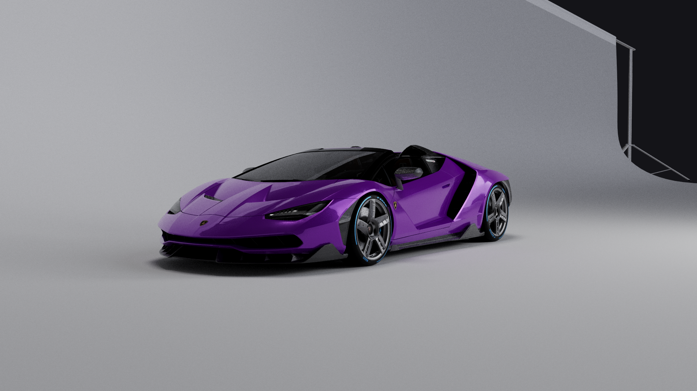
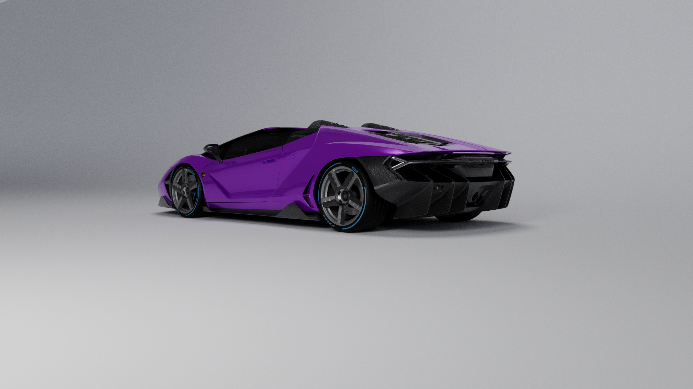
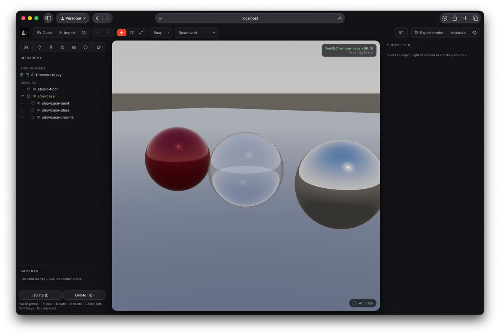
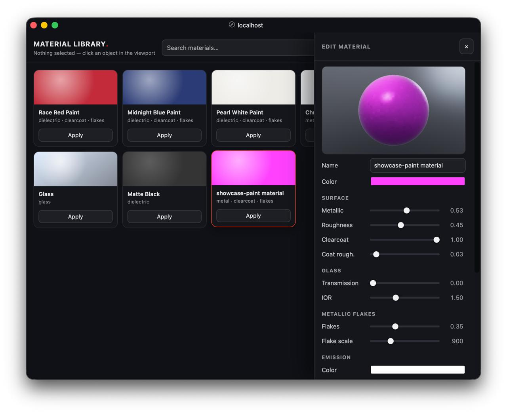
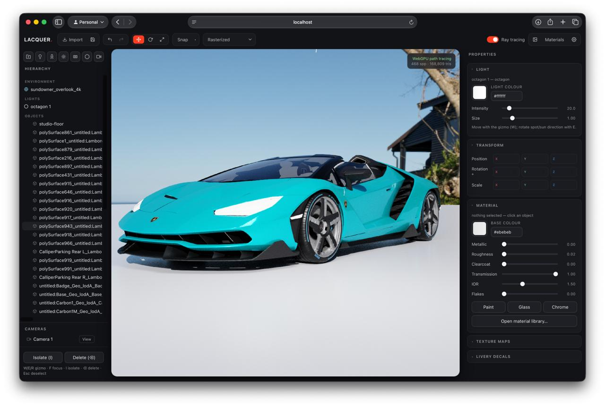

**Open-source, physically based, path-traced automotive visualization for the web.**

Lacquer renders offline-quality car imagery — real global illumination, believable
paint and glass, studio HDRIs, sponsor liveries — right in the browser, on whatever
device the viewer happens to have. It runs a WebGPU path tracer where it can and falls
back to a fast WebGL2 renderer everywhere else, so the same scene looks consistent from
a workstation to an iPad.

## Render Output Examples:




## Screenshots





---

## Table of contents

- [Requirements](#requirements)
- [Running it](#running-it)
- [Using the app](#using-the-app)
  - [Importing models and environments](#importing-models-and-environments)
  - [The workspace](#the-workspace)
  - [Materials and liveries](#materials-and-liveries)
  - [Lights](#lights)
  - [Cameras](#cameras)
  - [Ray tracing and view modes](#ray-tracing-and-view-modes)
  - [Exporting images](#exporting-images)
  - [Saving and loading scenes](#saving-and-loading-scenes)
  - [Keyboard shortcuts](#keyboard-shortcuts)
- [Architecture overview](#architecture-overview)
- [Browser and device support](#browser-and-device-support)
- [Building for production](#building-for-production)
- [License](#license)

---

## Requirements

- **Node.js 18 or newer** to run the development server and build.
- A modern browser. For the highest-quality path-traced view you want a browser with
  WebGPU (recent Chrome, Edge, Firefox, or Safari, including Safari on recent iPads and
  iPhones). Without WebGPU, Lacquer automatically uses its WebGL2 renderer instead.

## Running it

```bash
npm install     # install dependencies (one time)
npm run dev     # start the app
```

Then open the URL it prints (by default <http://localhost:5173>). You should see the
viewer with a default scene. Drag a `.glb`,`.fbx` or `.obj` model and a `.hdr` environment onto the
window to get started, or use the **Import** button in the top bar.

To make a production build:

```bash
npm run build     # outputs a static site to dist/
npm run preview   # serve the production build locally to check it
```

The contents of `dist/` are a static site you can host anywhere.

## Using the app

### Importing models and environments

Bring content in by dragging files onto the window or with the top-bar buttons:

- **Models** — `.glb`, `.gltf`, `.obj`, and `.fbx`. Materials and textures come in with
  the model. For `.obj` and `.fbx` files that reference external texture images, drop
  the model and its texture files together in one go.
- **Environments** — Radiance `.hdr` images light the scene and appear as the backdrop.
  A built-in procedural sky is used until you load one.
- **Scenes** — `.lacquer` files (see [Saving and loading](#saving-and-loading-scenes)).
  Use the **Open** button for these.

Models are automatically centered, set on the ground, and framed. Importing more than
one model adds them to the scene side by side rather than replacing what's there, so you
can build up a lineup.

### The workspace

- **Top bar** — open and import files, save, undo/redo, the move/rotate/scale tools,
  snapping, the view-mode selector, the ray-tracing toggle, image export, the material
  library, and settings.
- **Hierarchy (left)** — the whole scene as a tree: the environment, your lights, and
  the object hierarchy. Toggle visibility, delete, collapse groups, and drag objects
  into folders to organize them. The small toolbar above it adds folders, lights, and
  cameras.
- **Viewport (center)** — a raised, rounded render window. Orbit with the left mouse
  button, pan with right-drag or Shift-drag, and zoom with the scroll wheel.
- **Properties (right)** — shows only what applies to the current selection: material
  and decals for an object, or the settings for a selected light or camera, plus a
  numeric transform (position, rotation, scale).

Select objects by clicking them in the viewport or the hierarchy. The move, rotate, and
scale tools each show a distinct on-screen handle, and snapping (with adjustable steps)
keeps placement tidy.

### Materials and liveries

Select an object and use the **Material** section to set its look — base color, metallic
and roughness, clearcoat (the layer that makes car paint read as car paint), glass
transmission and index of refraction, metallic-flake sparkle, and emission for glowing
surfaces. You can also add **texture maps** (base color, normal, roughness, metallic)
and choose UV or triplanar (world-space) projection with adjustable tiling.

Presets for paint, glass, and chrome are one click away. The **material library** opens
in its own window with a live 3D preview: save the selected object's material, search
your saved materials, tweak them, and apply them to other objects.

**Liveries and decals** are added per object in the properties panel. Each decal is a
projector you place and aim with the gizmo — it only affects the object it belongs to,
so a door number never bleeds onto the panel behind it. Swap the image, set opacity, and
choose a glossy or matte finish.

### Lights

Add lights from the hierarchy toolbar: **point**, **spot**, **sun** (directional),
**rectangle**, and **octagon** area lights (softboxes). Select a light to set its color,
intensity, and — for spots — cone angle and softness, or — for area lights — size.
Bigger area lights are brighter and cast softer shadows.

Lights can aim at a **focus point**: a yellow target you drag to point the light exactly
where you want, with the light orbiting the target as you move it. You can also switch a
light to free aiming and rotate it directly.

### Cameras

Set up shots and come back to them. Frame a view, then add a camera from the hierarchy
toolbar to bookmark it. Select a camera to look through it, adjust its field of view, or
update it to your current view. An outline marks when you're looking through a camera,
so you always know which shot you're composing.

### Ray tracing and view modes

The **RT** button toggles path tracing on and off. With it on, the image refines
progressively toward a fully lit, physically accurate render; a small indicator shows
convergence. With it off, you get an instant real-time preview.

The **View** menu offers inspection modes beyond the standard look: wireframe, ambient
occlusion, shadows, a neutral lighting (clay) view, and a reflections-only view — handy
for checking topology, the light rig, or how reflective a surface is.

### Exporting images

**Export render** opens a dialog to render a still at any resolution you need. Choose the
size, whether to path-trace it (and how many samples to accumulate for a clean result),
and download it as a PNG or copy it straight to the clipboard. There's also a
**turntable** option that orbits the camera and exports a sequence of frames as a ZIP,
ready to turn into a spin video.

Renders use your current camera, lighting, and view settings, and always export at full
resolution.

### Saving and loading scenes

**Save** writes the entire scene — objects, materials and their textures, decals, lights,
cameras, and the environment — to a single `.lacquer` file. Open it later (or share it)
and everything comes back exactly, with no external files to keep track of. Undo and redo
cover just about every edit.

### Keyboard shortcuts

| Action | Shortcut |
|---|---|
| Move / Rotate / Scale tool | `W` / `E` / `R` |
| Frame the selection | `F` |
| Isolate the selection | `I` |
| Delete the selection | `Delete` / `Backspace` |
| Deselect | `Esc` |
| Set the orbit pivot | Double-click a surface |
| Set depth-of-field focus | Alt-click a surface |
| Undo / Redo | `Cmd/Ctrl+Z` / `Shift+Cmd/Ctrl+Z` |
| Save scene | `Cmd/Ctrl+S` |

## Architecture overview

Lacquer is built around one idea: a single scene, described once, that can be drawn by
either of two renderers depending on the device. You never have to choose — the app
picks the best available renderer at startup and can switch at runtime.

- **Path-traced renderer (WebGPU).** Simulates light physically, bouncing rays through
  the scene for true global illumination, accurate reflections and refractions, soft
  shadows from area lights, and depth of field. It refines the image progressively and
  uses a denoiser and a resolution upscaler so it stays responsive.
- **Real-time renderer (WebGL2).** A fast, image-based lighting approach that runs
  virtually anywhere with WebGL2. It trades some accuracy for instant feedback and broad
  device reach, while keeping materials, lights, and liveries looking consistent with the
  path-traced view.

Because the two renderers share the same materials and lighting model, you can work in
the fast view for responsiveness and switch to path tracing for the final look without
your scene changing character. This is what lets the same project run from a powerful
desktop down to a tablet.

## Browser and device support

- **Path tracing** needs WebGPU: recent Chrome, Edge, Firefox, and Safari on desktop,
  and Safari on recent iPads and iPhones.
- **The real-time renderer** works on effectively any device with WebGL2, including older
  laptops and mobile browsers, so the app runs even where WebGPU is unavailable.

## Building for production

```bash
npm run build
```

This produces a self-contained static site in `dist/` that you can deploy to any static
host or CDN.

## License

MIT — see [LICENSE](./LICENSE).
